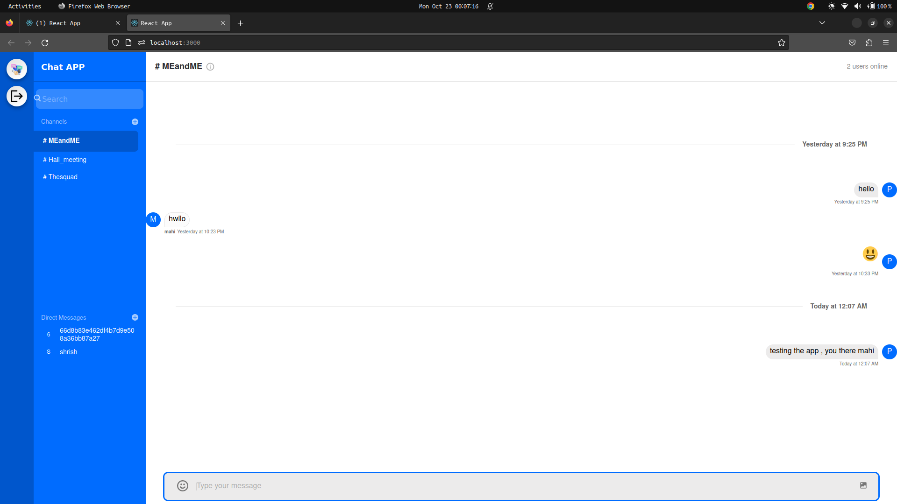
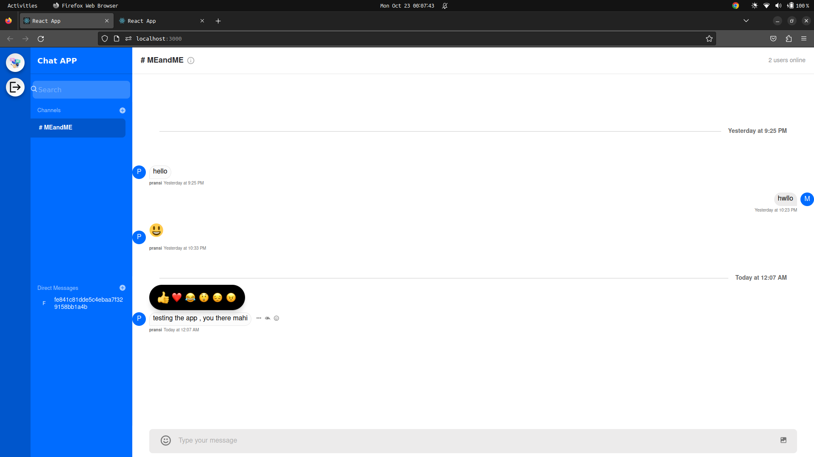
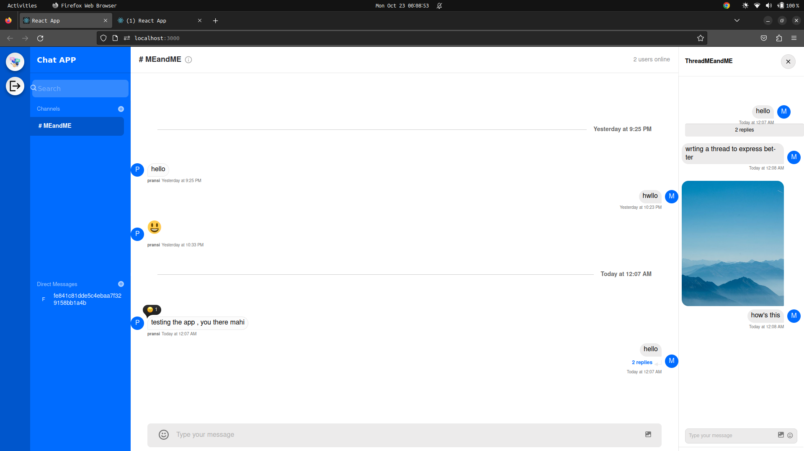
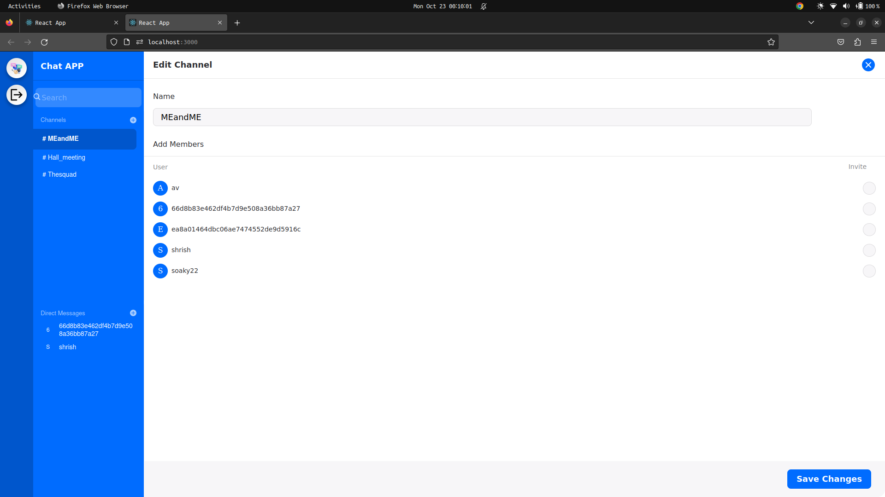

# Chatterbox-I'mbesideyou

Website link - https://rainbow-panda-72bf92.netlify.app/

Client Submodule Repository: https://github.com/shrish113398/chatclient

Name-Shrish Tripathi

Department-Mathematics and Computing   

University-IIT Kharagpur

## Technologies used

-NodeJS

-Express

-ReactJS

-StreamChat API

## Features Implemented 

-Direct Messaging

-Group Chat

-Group add/remove/edit flexibility

-Reactions to the messages

-Deleting a message

-Creating thread

-SMS alert (Twilio limited)

-Video Call (upcoming)

<p align="center">
  
</p>
Basic Atomic UI for attractive user interface with notifications for messages and group chats
<p align="center">
  
</p>
Features like deleting, reacting, and creating a thread on each message for fluid and connected communication
<p align="center">
  
</p>
Functionalities like sending images in thread as well as giving a more integrated experience
<p align="center">
  
</p>
Option the edit group name, member giving more friendly user interface with just a click 

## Code Structure
``````
├── chatclient

│       ├── node_modules

│       ├── package.json

│       ├── package-lock.json

│       ├── public

│       ├── README.md

│       └── src

├──     imgs

│       ├── 01.png

│       ├── 02.png

│       ├── 03.png

│       ├── 04.png

│       └── 05.png

├── README.md

└── server

        ├── controllers

        ├── index.js

        ├── node_modules

        ├── package.json

        ├── package-lock.json

        └── routes
``````  

## Setting Up 

1. Clone this public repository using
  
  `git clone https://github.com/shrish113398/Chatterbox.git`

2. Create and initialize an account on the stream chat service 'getstream.io'

3. now `cd client` and `npm install` for installing all the dependencies 

4. Similarly `cd server` and `npm install` for installing dependencies on the server side

5. Resolve any peer dependencies clashing due to different versions

6. Set up env using your credentials 

``````
STREAM_APP_ID = xxxxxxxxxxx
STREAM_API_KEY =xxxxxxxxx
STREAM_API_SECRET = xxxxxxxxxx
TWILIO_ACCOUNT_SID = xxxxxxxxxxxxx
TWILIO_AUTH_TOKEN = xxxxxxxxxxxxx
TWILIO_MESSAGING_SERVICE_SID = xxxxxxxxxxxx
``````
7. `npm run dev` for the backend

8. `npm start` for the client

9. Sign Up and start chatting.
